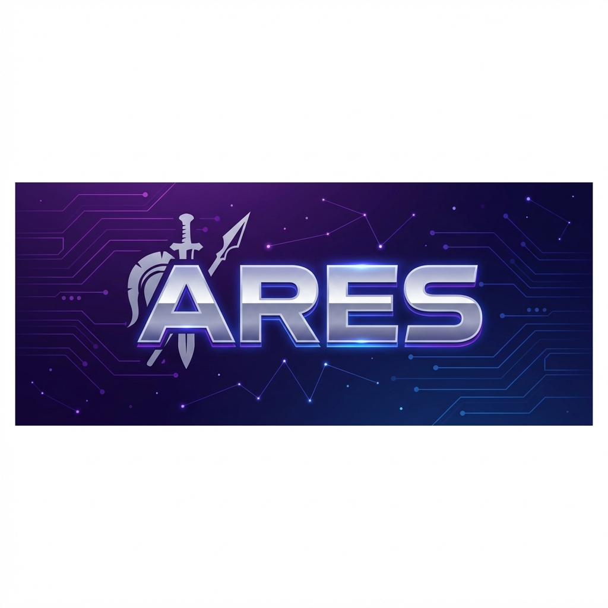

<p align="center">
  
</p>

<h1 align="center">Ares Discord Bot</h1>

<p align="center">
  <strong>A powerful, feature-rich, and fully modular Discord bot for moderation, music, leveling, and more.</strong>
</p>

<p align="center">
  <a href="https://discord.com/oauth2/authorize?client_id=1434107390856401049&permissions=8&scope=bot%20applications.commands"></a>
  <a href="https://discord.js.org"></a>
  <a href="https://nodejs.org"></a>
  
  
</p>

<p align="center">
  <a href="#overview">Overview</a> •
  <a href="#features">Features</a> •
  <a href="#installation">Installation</a> •
  <a href="#configuration">Configuration</a> •
  <a href="#commands">Commands</a> •
  <a href="#support">Support</a> •
  <a href="#license">License</a>
</p>

---

## Overview

**Ares** is a self-hosted, fully modular Discord bot built with [discord.js v14](https://discord.js.org). Named after the Greek god of war, Ares is designed to be a powerful ally for Discord server administrators, providing comprehensive moderation tools, music playback, leveling systems, statistics tracking, and much more.

Whether you need a strict moderation bot, an engaging music player, or a complete server management solution — Ares has you covered. Every feature can be configured and customized to fit your server's unique needs.

### Key Highlights

- 🛡️ **Comprehensive Moderation** — Over 75+ moderation commands including advanced features like raid protection, detention system, and cascade roles
- 🎵 **High-Quality Music** — Powered by Shoukaku/Lavalink for seamless music playback from YouTube, Spotify, and more
- 📊 **Advanced Statistics** — Track messages, voice activity, invites, and more with detailed leaderboards
- ⬆️ **Leveling System** — Full XP-based leveling with customizable rewards, rank cards, and role rewards
- 🎫 **Ticket System** — Complete ticket management with transcripts and custom categories
- 🔒 **Security Features** — Anti-nuke, anti-raid, and automod protection for your server

---

## Features

Ares includes a comprehensive set of modules, each packed with powerful commands:

### 🛡️ Moderation (75+ commands)

- **Basic Actions** — Ban, kick, mute, warn, softban, tempban
- **Mass Actions** — Massban, masskick, massmute for handling raids
- **Advanced Tools** — Detention system, role management, force nickname
- **Channel Management** — Lock, unlock, hide, unhide, slowmode, nuke
- **Logging** — Comprehensive mod logs with case management
- **User Notes** — Add, remove, and track notes on users
- **Warnings System** — Full warning management with crime files

### 🎵 Music (15 commands)

- **Playback** — Play, pause, resume, stop, skip
- **Queue Management** — Queue, remove, shuffle, clear
- **Features** — Loop, autoplay, volume control, 24/7 mode
- **Platforms** — YouTube, YouTube Music, Spotify, SoundCloud

### 📊 Statistics & Tracking (22 commands)

- **Message Stats** — Track message activity per user and channel
- **Voice Stats** — Monitor voice channel activity and time spent
- **Invite Tracking** — Track who invited whom with leaderboards
- **Time Periods** — Daily, weekly, monthly, and all-time stats
- **Leaderboards** — Competitive rankings for all tracked metrics

### ⬆️ Leveling System (13 commands)

- **XP System** — Earn XP from messages and voice activity
- **Rank Cards** — Beautiful customizable rank cards
- **Role Rewards** — Automatic role assignment on level up
- **Leaderboards** — Server-wide level rankings
- **Admin Tools** — Add/remove XP, set levels, reset progress

### 🎉 Giveaways

- Create and manage giveaways with customizable duration
- Multiple winners support
- Requirement-based entries

### 🎫 Ticket System

- Customizable ticket categories
- Transcript generation
- Staff role management
- Ticket panels with buttons

### 🌟 Starboard

- Highlight popular messages
- Customizable star threshold
- Beautiful embed formatting

### 🎂 Birthday System

- Birthday tracking and announcements
- Automatic birthday role assignment
- Server birthday calendar

### ⏰ Bump Reminder

- Automatic bump reminders for DISBOARD
- Customizable reminder messages
- Bump streak tracking

### 🔒 Security & Protection

- **Anti-Nuke** — Protect against malicious admin actions
- **Anti-Raid** — Automatic raid detection and prevention
- **Automod** — Word filters, spam protection, link blocking

### 🔊 Voice Commands (14 commands)

- Voice channel management
- Temporary voice channels
- User permissions control

### 🎮 Fun Commands

- 8ball, ship, coinflip, roll
- Rate, choose, hack
- Interactive entertainment features

### ⚙️ Server Configuration

- Prefix customization
- Module toggles
- Channel configurations
- Permission management

---

## Installation

### Prerequisites

Before installing Ares, ensure you have the following:

- [Node.js](https://nodejs.org/) v18.17.0 or higher
- [Git](https://git-scm.com/)
- A Discord Bot Token ([Discord Developer Portal](https://discord.com/developers/applications))
- A Lavalink server for music features (optional)

### Quick Start

1. **Clone the repository**

   ```bash
   git clone https://github.com/Suyash-24/Ares.git
   cd Ares
   ```

2. **Install dependencies**

   ```bash
   npm install
   ```

3. **Configure environment variables**

   ```bash
   cp .env.example .env
   ```

   Edit `.env` and add your Discord bot token:

   ```env
   DISCORD_TOKEN=your_bot_token_here
   ```

4. **Configure the bot**

   Edit `config.json` to customize:
   - Bot prefix
   - Owner IDs
   - Lavalink nodes (for music)
   - Other settings

5. **Start the bot**
   ```bash
   npm start
   ```

### Running with PM2 (Recommended for Production)

```bash
# Install PM2 globally
npm install -g pm2

# Start the bot
pm2 start index.js --name ares-bot

# View logs
pm2 logs ares-bot

# Auto-restart on system reboot
pm2 startup
pm2 save
```

---

## Configuration

### config.json

```json
{
  "token": "",
  "clientId": "YOUR_CLIENT_ID",
  "prefix": ".",
  "ownerIds": ["YOUR_USER_ID"],
  "testGuildIds": [],
  "presence": {
    "activities": [
      {
        "name": "for /help",
        "type": "Watching"
      }
    ],
    "status": "online"
  },
  "lavalink": {
    "nodes": [
      {
        "identifier": "Primary",
        "host": "your-lavalink-host.com",
        "port": 443,
        "password": "your-password",
        "secure": true
      }
    ]
  }
}
```

### Environment Variables (.env)

| Variable        | Description            | Required |
| --------------- | ---------------------- | -------- |
| `DISCORD_TOKEN` | Your Discord bot token | ✅       |

---

## Commands

Ares supports both **prefix commands** and **slash commands**. The default prefix is `.` (configurable).

### Command Categories

| Category    | Commands | Description                         |
| ----------- | -------- | ----------------------------------- |
| Moderation  | 75+      | Server moderation and management    |
| Music       | 15       | Music playback and queue management |
| Leveling    | 13       | XP and level management             |
| Statistics  | 22       | Activity tracking and leaderboards  |
| Voice       | 14       | Voice channel management            |
| Fun         | 7        | Entertainment commands              |
| General     | 18+      | Utility and information commands    |
| Server      | 10       | Server configuration                |
| Tickets     | 1+       | Ticket system management            |
| Giveaways   | 1+       | Giveaway management                 |
| And more... |          |                                     |

Use `.help` or `/help` to see all available commands.

---

## Tech Stack

- **Runtime**: [Node.js](https://nodejs.org/) ≥18.17.0
- **Library**: [discord.js](https://discord.js.org/) v14
- **Database**: [SQLite](https://sqlite.org/) (better-sqlite3)
- **Music**: [Shoukaku](https://github.com/Deivu/Shoukaku) + [Lavalink](https://github.com/lavalink-devs/Lavalink)
- **Image Generation**: [@napi-rs/canvas](https://github.com/Brooooooklyn/canvas)

---

## Project Structure

```
Ares/
├── index.js              # Entry point
├── config.json           # Bot configuration
├── package.json          # Dependencies
├── data/                 # Database and data files
├── src/
│   ├── commands/
│   │   ├── prefix/       # Prefix commands (22 categories)
│   │   └── slash/        # Slash commands
│   ├── events/           # Event handlers
│   ├── handlers/         # Message and interaction handlers
│   └── utils/            # Utility functions
└── docs/                 # Documentation
```

---

## Support

If you need help or have questions:

- 🤖 [Invite Ares to your server](https://discord.com/oauth2/authorize?client_id=1434107390856401049&permissions=8&scope=bot%20applications.commands)
- 📖 Check the [Documentation](docs/)
- 🐛 Report bugs via [GitHub Issues](https://github.com/Suyash-24/Ares/issues)
- ⭐ Star this repository if you find it useful!

---

## Contributing

Contributions are welcome! Please feel free to submit a Pull Request.

1. Fork the repository
2. Create your feature branch (`git checkout -b feature/AmazingFeature`)
3. Commit your changes (`git commit -m 'Add some AmazingFeature'`)
4. Push to the branch (`git push origin feature/AmazingFeature`)
5. Open a Pull Request

---

## License

This project is licensed under the MIT License - see the [LICENSE](LICENSE) file for details.

---

<p align="center">
  <strong>Made with ❤️ by Suyash</strong>
</p>

<p align="center">
  <sub>Ares — Named after the Greek god of war, courage, and civil order.</sub>
</p>
